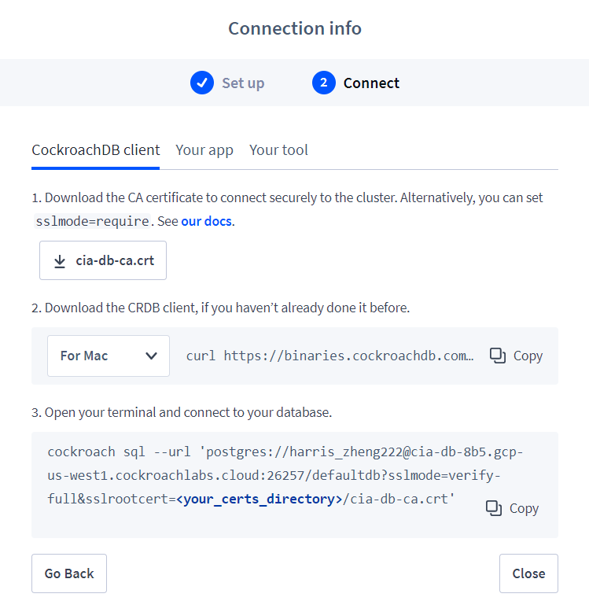

# Database Setup Instructions

- Install CockroachDB Binary: https://www.cockroachlabs.com/docs/v20.2/install-cockroachdb-windows.html.
- Use the certification file in the root directory of the project.

- Make sure cockroach binary folder is added to your SYSTEM environment PATH. Run this command in the ROOT directory:

```
cockroach sql --url 'postgres://harris_zheng222@cia-db-8b5.gcp-us-west1.cockroachlabs.cloud:26257/defaultdb?sslmode=verify-full&sslrootcert=./database/cia-db-ca.crt'
```

Make this an alias in your .bashrc file if you don't want to type out this command everytime. Make sure you run
source '~/.bashrc' so that the .bashrc file is activated during the current session.

 
